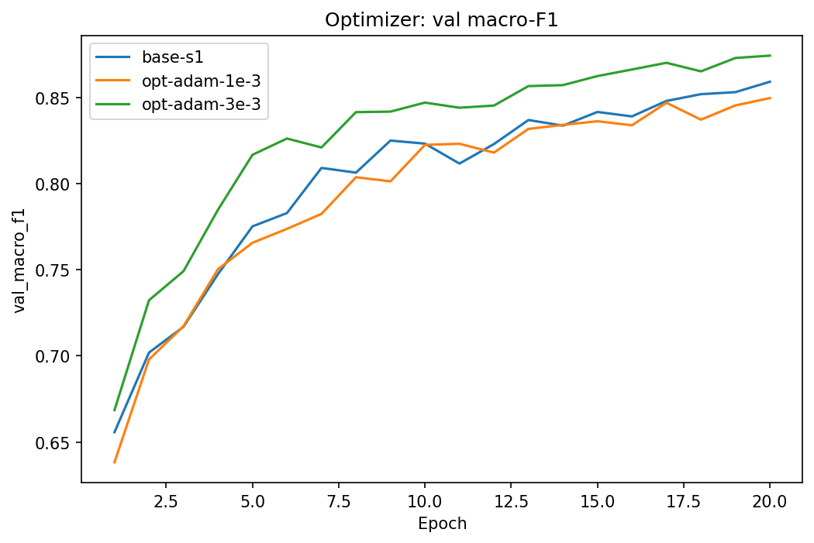
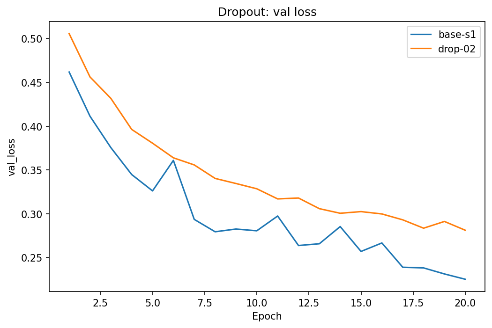
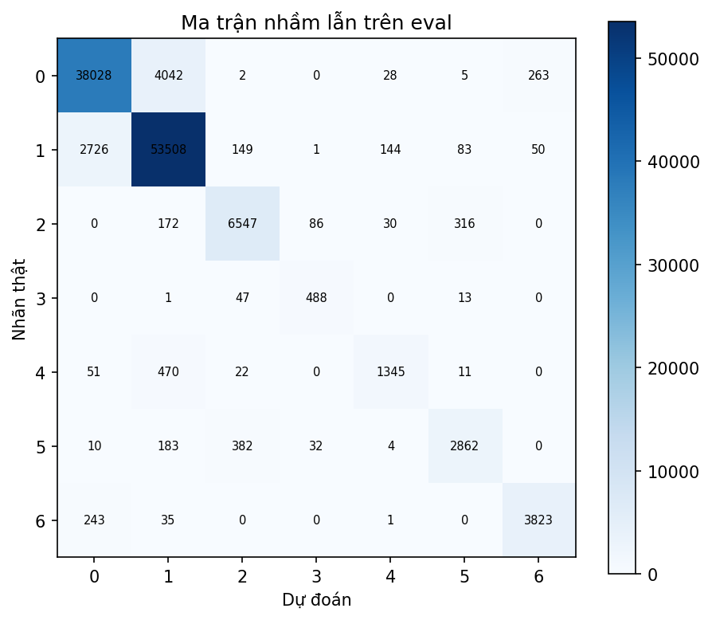

# Báo cáo Lab Day 1 — MSSV 2A202602489

## 1. Thiết lập

Bài toán là phân loại Forest CoverType thành 7 lớp từ 54 đặc trưng. Môi trường chạy: VS Code, PyTorch 2.14.0+cpu. Dữ liệu được chia theo `split_metadata.csv`: 464.809 mẫu train gốc và 116.203 mẫu eval. Từ train gốc, tôi tách validation phân tầng 20% với seed 42, còn 371.847 train và 92.962 val. Tôi chỉ tính mean/std của 10 cột liên tục trên 371.847 mẫu train, rồi áp dụng cho val và eval; 44 cột one-hot giữ nguyên. Đoán luôn lớp đông nhất cho val accuracy 0,4876.

Model M-base là `54→256→128→7`, ReLU ở các lớp ẩn, bias ở mọi lớp tuyến tính, đầu ra logits. Baseline dùng He, cross-entropy, SGD momentum 0,9, batch 512, 20 epoch, FP32, không dropout và không clipping. Dò `lr` bằng ba lần chạy 3 epoch trên val: `0,01` cho macro-F1 0,6170; `0,03` cho 0,6807; `0,1` cho 0,7169. Tôi chọn `lr=0,1` cho baseline. Các thí nghiệm chính đều chạy 20 epoch và dùng cùng phép chia dữ liệu. Cấu hình cuối được chọn bằng val trước khi xem eval.

## 2. Kiểm tra ban đầu và độ nhiễu

M-base có đúng **47.879 tham số** và đầu ra `(B,7)`. Loss bước 0 trong phép kiểm tra Part 1 là **2,3776**, cao hơn `ln(7)=1,9459`; khởi tạo He tạo logits chưa đều nên đây là mốc tham khảo, không phải điều kiện bằng nhau. Cả sáu tensor tham số đều có gradient khác 0. Model học thuộc 20 mẫu với loss khoảng **0,000001** và accuracy **100%**. Kiểm tra này xác nhận nhãn, forward, backward và bước cập nhật hoạt động trên một lô nhỏ.

| Baseline | Val accuracy | Val macro-F1 | Best epoch |
|---|---:|---:|---:|
| `base-s1` | 0,9090 | 0,8591 | 20 |
| `base-s2` | 0,9121 | 0,8541 | 20 |
| `base-s3` | 0,9127 | 0,8606 | 20 |

Val macro-F1 trung bình **0,8579 ± 0,0034** (độ lệch chuẩn mẫu); ngưỡng tham khảo `2σ = 0,0068`. Val accuracy trung bình **0,9113 ± 0,0020**. Loss trên val nhìn chung còn giảm đến epoch 20; train loss cuối được đo trên cùng 50.000 mẫu train, thấp hơn val loss khoảng 0,02. Chênh lệch này cho thấy một khoảng cách tổng quát hoá nhỏ trong ngân sách 20 epoch, chưa phải bằng chứng quá khớp nặng.

## 3. Thí nghiệm trên validation

Các số dưới đây là macro-F1 tại epoch có **val loss thấp nhất**. Mỗi lần thử giữ seed 1 và 20 epoch, trừ thay đổi được ghi trong `experiments.xlsx`. Ảnh riêng của từng lần chạy nằm ở `figures/<exp_id>.png`.

| Chủ đề / `exp_id` | Val macro-F1 | So với `base-s1` | Nhận xét |
|---|---:|---:|---|
| `loss-mse` | 0,7388 | −0,1203 | MSE trên logits/one-hot kém CE rõ rệt. Không so trực tiếp trị số loss vì hai hàm khác thang đo. |
| `opt-adam-1e-3` | 0,8496 | −0,0095 | Adam ở lr 0,001 chưa thắng baseline. |
| `opt-adam-3e-3` | **0,8742** | **+0,0152** | Cao nhất; chênh lệch vượt ngưỡng 2σ của baseline. |
| `batch-256` | 0,8622 | +0,0031 | Chênh lệch chưa vượt nhiễu; batch nhỏ gấp đôi số bước cập nhật mỗi epoch và mất khoảng 5,83 s/epoch thay vì 3,83. |
| `drop-02` | 0,8209 | −0,0381 | Dropout 0,2 giảm kết quả trong 20 epoch; phù hợp với việc baseline chưa quá khớp nặng. |
| `clip-1` | 0,8533 | −0,0057 | Chênh lệch chưa vượt nhiễu; clipping có thể hạn chế cập nhật hữu ích ở lr này. |
| `init-xavier` | 0,8544 | −0,0047 | Chênh lệch chưa vượt nhiễu; chưa đủ bằng chứng He hơn Xavier trên bài này. |

Adam cần learning rate riêng: `0,003` tốt hơn `0,001` khoảng 0,0246 macro-F1. Khi so Adam với SGD, tôi thay cả loại optimizer và lr phù hợp với từng loại; đây là cặp cấu hình chứ không phải thí nghiệm chỉ đổi một biến. Đường val macro-F1 của `opt-adam-3e-3` tăng nhanh và duy trì trên baseline từ khoảng epoch 5. Tôi chọn cấu hình này cho bước eval vì val macro-F1 0,8742 và val loss 0,2075 tại epoch 20, tốt nhất trong các lần chạy.

Với clipping, grad norm trung bình trước khi cắt của `base-s1` khoảng 0,58, dưới ngưỡng 1. Có thể có bước riêng lẻ vượt ngưỡng, nhưng trung bình này không cho thấy nhu cầu clipping thường xuyên. MSE có grad norm trung bình khoảng 0,09 so với CE 0,58; đây là một dấu hiệu về khác biệt tín hiệu cập nhật, dù không thể suy ra toàn bộ nguyên nhân từ chuẩn gradient. Mixed precision không được thử vì máy chạy CPU; không có kết luận về tốc độ FP16/BF16 trên GPU.

## 4. Đánh giá cuối trên eval

Chỉ sau khi chọn `opt-adam-3e-3` bằng validation, tôi tạo dự đoán trên toàn bộ **116.203** mẫu eval và chạy `scripts/evaluate.py`. Số dưới đây lấy từ các file JSON của script chấm, không dùng để chỉnh lại cấu hình.

| Cấu hình | Seed | Val macro-F1 | Eval macro-F1 | Eval accuracy |
|---|---:|---:|---:|---:|
| `base-s1` | 1 | 0,8591 | 0,8614 | 0,9075 |
| `opt-adam-3e-3` | 1 | 0,8742 | **0,8794** | **0,9174** |

Cấu hình cuối tăng **0,0179 macro-F1** và **0,0099 accuracy** trên eval so với baseline seed 1. Val và eval gần nhau: macro-F1 chênh khoảng +0,0052 ở cấu hình cuối. Chỉ có một seed được chấm eval cho mỗi cấu hình, nên không ước lượng được độ nhiễu eval trực tiếp.

### Lỗi theo lớp

| Lớp | Support | Precision | Recall | F1 |
|---|---:|---:|---:|---:|
| 0 | 42.368 | 0,9262 | 0,8976 | 0,9117 |
| 1 | 56.661 | 0,9161 | 0,9444 | 0,9300 |
| 2 | 7.151 | 0,9158 | 0,9155 | 0,9157 |
| 3 | 549 | 0,8040 | 0,8889 | 0,8443 |
| 4 | 1.899 | 0,8666 | 0,7083 | **0,7795** |
| 5 | 3.473 | 0,8699 | 0,8241 | 0,8464 |
| 6 | 4.102 | 0,9243 | 0,9320 | 0,9281 |

Lớp 4 (Aspen) khó nhất theo F1 và recall. Trong 1.899 mẫu thật của lớp này, **470 mẫu bị nhầm thành lớp 1**. Lớp 4 chỉ chiếm khoảng 1,6% eval; mất cân bằng có thể góp phần làm recall thấp. Cũng có nhiều lỗi tuyệt đối giữa lớp 0 và 1 (4.042 mẫu lớp 0 đoán thành 1, 2.726 mẫu lớp 1 đoán thành 0), nhưng hai lớp này rất đông nên F1 vẫn cao. Một bước cải thiện có chủ đích là thử class weighting hoặc lấy mẫu cân bằng hơn, rồi kiểm tra lại trên val trước khi dùng eval.

## 5. Trả lời câu hỏi dẫn dắt

**Optimizer.** Kết quả phụ thuộc learning rate: Adam 0,001 đạt 0,8496, Adam 0,003 đạt 0,8742, còn SGD momentum 0,1 đạt 0,8591 trên seed 1. Vì vậy không thể kết luận bằng một lr chung. Chênh lệch Adam 0,003 với baseline vượt ngưỡng 2σ của baseline trên val.

**Dropout.** Baseline chưa có khoảng cách train–val lớn trong 20 epoch; dropout 0,2 làm val macro-F1 giảm xuống 0,8209. Nên thử dropout khi có bằng chứng quá khớp rõ hơn hoặc khi tăng thời gian/độ lớn model.

**Clipping.** Nó hạn chế gradient lớn để tránh cập nhật quá mạnh. Ở lr hiện tại, grad norm trung bình dưới 1 và `clip-1` không cải thiện đáng kể. Thử ở lr gây bất ổn sẽ kiểm tra tác dụng cứu hội tụ rõ hơn.

**Khởi tạo.** Khởi tạo toàn số 0 làm các nơ-ron cùng lớp nhận gradient đối xứng, không học được biểu diễn khác nhau. He dùng phương sai `2/fan_in` phù hợp ReLU; Xavier cân bằng theo cả fan-in và fan-out. `init-xavier` chỉ kém baseline 0,0047, nhỏ hơn ngưỡng nhiễu nên chưa kết luận được khác biệt ở đây.

**Nếu loss không giảm sau 2.000 bước:** (1) kiểm tra dữ liệu và nhãn 0..6, shape/dtype, chuẩn hoá bằng train và loss bước 0; (2) thử học thuộc 20 mẫu, kiểm tra logits và gradient từng tham số để xác nhận backward/update; (3) kiểm tra learning rate, optimizer, grad norm và loss NaN/inf, rồi thử một dải lr nhỏ trên val. Các phép này lần lượt khoanh vùng dữ liệu, đường gradient và vòng tối ưu.

## 6. Hạn chế

Các thí nghiệm ngoài baseline chỉ chạy một seed; chênh lệch nhỏ hơn 0,0068 chưa đủ để kết luận. Dò lr baseline chỉ dùng 3 epoch, nên có thể bỏ lỡ lr tốt hơn ở 20 epoch. So batch theo số epoch làm số bước cập nhật khác nhau. Train loss được đo trên một tập con cố định 50.000 mẫu, còn val loss trên toàn bộ val. Chưa thử mixed precision do chạy CPU. Kết quả eval chỉ dùng một seed cho baseline và cấu hình cuối.
